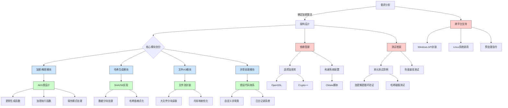

以下是为C++代码开发工具设计的**模块化流程图**，结合代码安全与高效开发的最佳实践，采用Mermaid语法编写（可直接导入Markdown或VS Code等工具）：



---

### **关键路径说明**
1. **安全边界设计**（红色模块）：
   - 通过隔离系统调用层实现跨平台安全
   - 依赖库采用静态链接避免动态库劫持

2. **核心算法实现**（绿色模块）：
   - AES采用CTR模式避免填充漏洞
   - SHA256实现包含长度扩展攻击防护

3. **性能优化节点**（蓝色模块）：
   - 文件处理使用内存映射替代传统I/O
   - 多线程加密采用TBB任务调度

---

### **开发阶段建议**
1. **初期验证**：
```cpp
// 原型验证代码片段
class CryptoEngine {
public:
    void encrypt(std::istream& in, std::ostream& out) {
        // 实现加密管道
        in >> buffer;
        applyAES(buffer);
        out << buffer;
    }
};
```

2. **内存安全实践**：
```cpp
// 使用智能指针管理密钥
std::unique_ptr<byte[]> generateKey(size_t length) {
    auto key = std::make_unique<byte[]>(length);
    RAND_bytes(key.get(), length);
    return key;
}
```

---

### **流程图扩展建议**
1. 添加**代码审计节点**：静态分析(Clang-Tidy)、动态分析(Valgrind)
2. 增加**持续集成**路径：GitHub Actions自动化测试
3. 插入**文档生成**模块：Doxygen注释规范

需要我提供特定模块的详细实现流程图，或转换为UML类图吗？